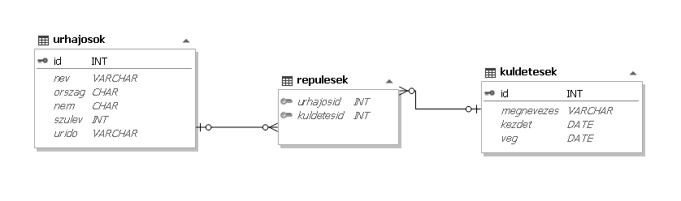
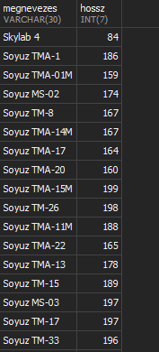
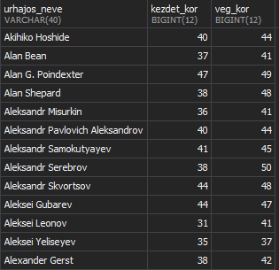
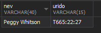
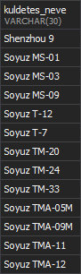
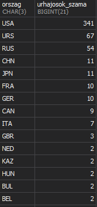

## 3. Űrhajózás 

A múlt század második felében az ember meghódította a világűrt is. A legtöbb ember ismeri Gagarin, Armstrong és Farkas Bertalan nevét. Természetesen rajtuk kívül is sokan jártak az űrben. Az adatbázis az adatgyűjtéskor már befejezett küldetések és az űrhajósok adatait tartalmazza.

**1. Készítsen adatbázist eurovizio néven!**

- Futassa az (`urhajo.sql`) állományt, az adatbázis elkészítéséhez, feltöltéséhez.
- A feladatok megoldására elkészített SQL parancsokat a `Vezetéknév_Kersztnév_Osztály_űrhajozás.sql` állományba illessze be! A javítás során csak ennek az állománynak a tartalma lesz értékelve!

#### Táblák:

**1. `urhajosok` <small>(*id, nev, orszag, nem, szulev, urido*)</small>**
|Név|Típus|Leírás|PK|FK|
|---|---|---|---|---|
| id | int | Az űrhajós azonosítója (szám), ez a kulcs. |✓||
| nev | string | Az űrhajós neve (szöveg). Feltételezheti, hogy a nevek egyediek. |||
| orszag | char | Az űrhajós által képviselt ország az első kilövéskor (szöveg). Értéke hárombetűsazonosító. |||
| nem | char | Az űrhajós személy neme (szöveg). Értéke a férfiak esetén F, nőknél N. |||
| szulev | int | Az űrhajós születési éve (szám). |||
| urido | string | Az űrhajós által az űrben töltött összes idő (szöveg). Az első &karaktere minden esetben a T betű, utána 3 karakter a napokat, 2 az órákat, 2 a perceket jelöli. A számokat kettőspontválasztja el egymástól. |||

**2. `repulesek` <small>(*urhajosid, kuldetesid*)</small>**

|Név|Típus|Leírás|PK|FK|
|---|---|---|---|---|
| urhajosId | int | Az űrhajós azonosítója (szám), ez a kulcs. ||✓|
| kuldetesId | int | A küldetés azonosítója (szám), ez a kulcs.  ||✓|

**3 .`kuldetesek` <small>(*id, megnevezes, kezdet, veg*)</small>**

|Név|Típus|Leírás|PK|FK|
|---|---|---|---|---|
| id | int | A küldetés azonosítója (szám), ez a kulcs. |✓||
| megnevezes | string | A küldetés hivatalos neve (szöveg). |||
| kezdet | date | A küldetés kezdetének dátuma (dátum). |||
| veg | date | A küldetés befejezésének dátuma (dátum). |||

  
A következő feladatok megoldásánál ügyeljen arra, hogy a lekérdezésben pontosan a kívánt mezők szerepeljenek,
felesleges mezőt ne jelenítsen meg!
 

2. Illessze be a kuldetesek táblába a 2022. október 6-án kezdődött és 2023. március 11-én véget érő SpaceX Crew-5 expedíciót 323-as azonosítóval!
 

 

3. Simonyi Károly hivatalos neve jelenleg Charles Simonyi. Javítsa ki az urhajosok táblában Simonyi Károly nevét Charles Simonyi-ra.
 

 

4. Az egyik táblába hiba folytán fel lett véve egy hibás rekord. Törölje ki a "Nits László" nevű személyt az urhajosok adattáblából!
 

 

5. Lekérdezés segítségével határozza meg, hogy a nők közül ki töltötte a legtöbb időt az űrben
és mennyit! Jelenítse meg az űrhajós nevét és az urido mező értékét! 
 

 

6. Előfordult, hogy egy küldetés résztvevői az újévet az űrben köszöntötték. Készítsen
lekérdezést, amely megadja ezen küldetések megnevezését és azt, hogy milyen hosszúak
voltak, azaz hány napig tartottak! 
 

 

7. Készítsen lekérdezést, amelyik megadja, hogy a több űrrepülésen részt vevő űrhajósok hány
éves korukban kezdték az első és hány éves korukban az utolsó küldetésüket! Jelenítse meg
az űrhajós nevét, és a két életkort!
 

 

8. Lekérdezés segítségével határozza meg, hogy az egyes országoknak hány űrhajósa szerepel
az adatbázisban! Az országok azonosítóját és az adott ország űrhajósainak számát
az űrhajósok száma szerint csökkenő sorrendben jelenítse meg!
 

 

9. Határozza meg, hogy hány ország képviseletében repültek az űrhajósok! Ehhez egészítse ki
az alábbi lekérdezést, úgy, hogy válaszoljon az előbbi kérdésre! A teljes lekérdezést mentse!
 
<!--  -->
 

10.  Készítsen lekérdezést, amelyben felsorolja azoknak a küldetéseknek a nevét, amelyben
legénység tagjai között férfi és nő is volt!
 
<!--  -->
 

11.  Készítsen jelentést arról, hogy a 20. század utolsó évtizedében (1991-2000) megkezdett
11. Készítsen lekérdezést arról, hogy a 20. század utolsó évtizedében (1991-2000) megkezdett
küldetéseken milyen legénység vett részt! A listában a küldetés neve és kezdete kiemelve,
azon belül a nevek ábécérendben jelenjenek meg! A jelentés készítését lekérdezéssel
készítse elő! A jelentés elkészítésekor a mintából a mezők sorrendjét, a cím és a címkék
megjelenítését vegye figyelembe! A jelentés formázásában a mintától eltérhet. 
 
<!--  -->
 
